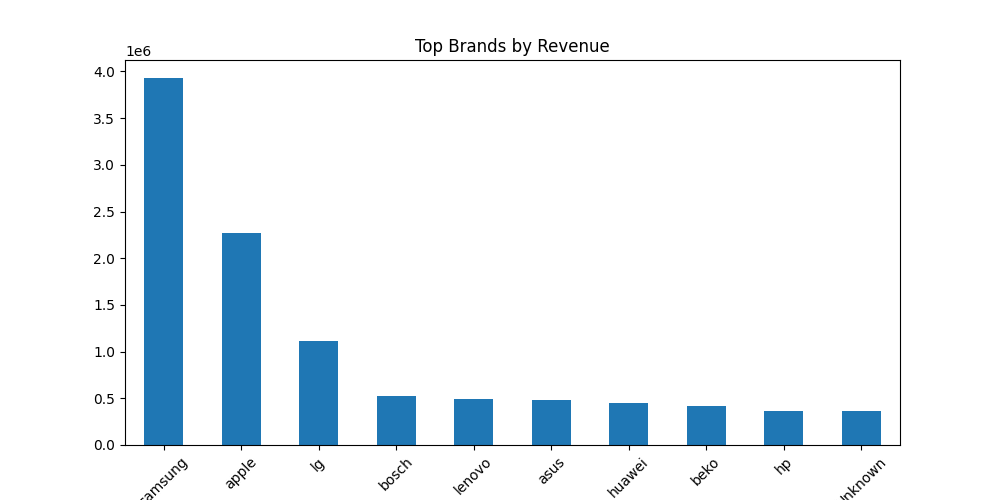
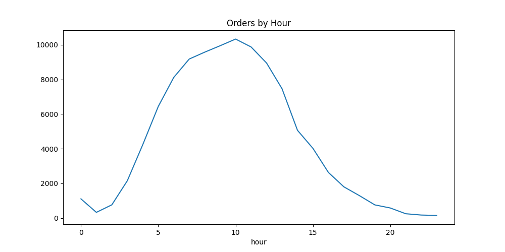
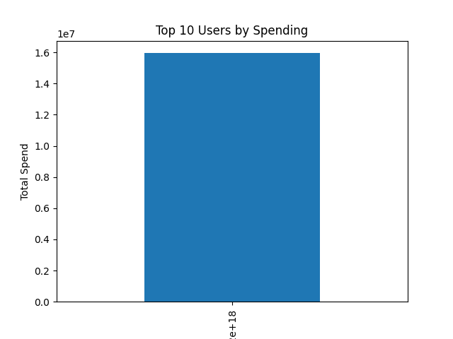
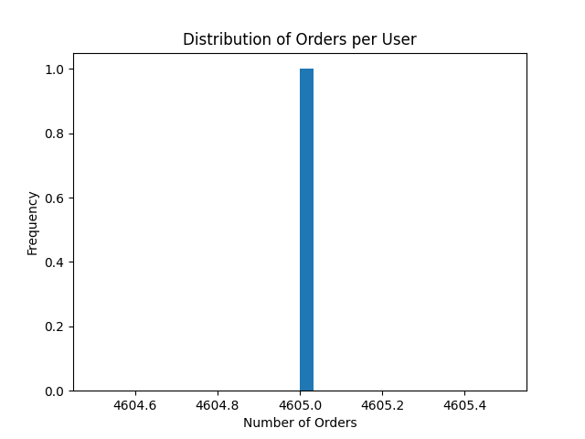

# 🛒 E-Commerce Behavioral Data Analysis

## 📌 Objective
The objective of this project is to analyze customer behavior in a multi-category e-commerce store to uncover patterns in purchasing, identify revenue drivers, and generate actionable business insights for improving sales and customer engagement.

---

## 📂 Dataset
- Source: Kaggle  
- Dataset: E-Commerce Behavioral Data from a Multi-Category Store  

> ⚠️ Note: The dataset is not included in this repository due to size constraints. Please download it from Kaggle and update the file path in the script before running the analysis.

---

## 🛠 Tools & Technologies Used
- Python  
- Pandas    
- Matplotlib  

---

## 🧹 Data Cleaning & Preprocessing
The dataset was preprocessed to ensure data quality and consistency:

- Selected relevant columns:
  - `event_time`, `order_id`, `product_id`, `brand`, `price`, `user_id`
- Converted data types:
  - `event_time` → DateTime format  
  - `price` → Numeric format  
- Handled missing values:
  - Filled missing `brand` values with **'Unknown'**
- Removed:
  - Rows with missing `price` or `user_id`  
  - Duplicate records  
  - Invalid price values (price ≤ 0)  

---

## 📊 Key Business Questions
- Which brands are driving the majority of total revenue?
- Which products contribute most to total sales?
- Who are the top customers by spending?
- What is the distribution of orders per user?
- When do peak order activities occur?
- How does revenue change over time?

---

## 📊 Analysis Performed

### 🔹 Revenue Analysis
- Total revenue calculation  
- Top brands by revenue  
- Top products by revenue  

### 🔹 Customer Behavior Analysis
- Total unique users  
- Order frequency distribution  
- Identification of high-value customers  

### 🔹 Time-Based Analysis
- Orders by hour  
- Daily revenue trends  
- Peak order hours  

### 🔹 Customer-Level Aggregation
- Top users by total spending  
- Average spending per user  

---

## 📈 Key Insights

- A small number of brands contribute a significant portion of total revenue, indicating strong brand concentration  
- High-performing products drive a large share of sales  
- Most users place very few orders, highlighting low customer engagement  
- A small group of high-value customers contributes disproportionately to total revenue  
- Orders peak during specific hours, useful for targeted marketing campaigns  
- Revenue fluctuates over time, indicating changing demand patterns  

---

## 📊 Visualizations

### 🔹 Top Brands by Revenue

**Insight:** A small number of brands dominate total revenue, indicating strong brand concentration.

---

### 🔹 Orders by Hour

**Insight:** Orders peak during specific hours, helping optimize marketing and operations.

---

### 🔹 Top Users by Spending

**Insight:** A small group of customers contributes significantly to overall revenue.

---

### 🔹 Distribution of Orders per User

**Insight:** Most users place very few orders, indicating low engagement and retention opportunities.

## 📂 Project Files

-  ecommerce_analysis.py – Main Python script containing:
  - Data cleaning and preprocessing  
  - Exploratory Data Analysis (EDA)  
  - Revenue and customer behavior analysis  
  - Visualizations and insights  

- README.md – Project documentation  

---

## 📈 Summary Statistics

- The dataset shows significant variation in pricing, indicating the presence of both low-value and high-value transactions  
- Customer purchasing behavior varies widely across users  
- Data highlights opportunities for segmentation and targeted marketing  

---

## 🚀 Business Impact

This analysis can help businesses:

- Identify high-value customers for targeted retention strategies  
- Focus on top-performing brands and products  
- Optimize marketing campaigns based on peak activity times  
- Improve customer engagement and conversion rates  

---

## 🚀 Conclusion

This project provides a comprehensive analysis of customer behavior in an e-commerce environment. The insights derived can support data-driven decision-making in marketing, product strategy, and customer retention, ultimately leading to improved business performance.